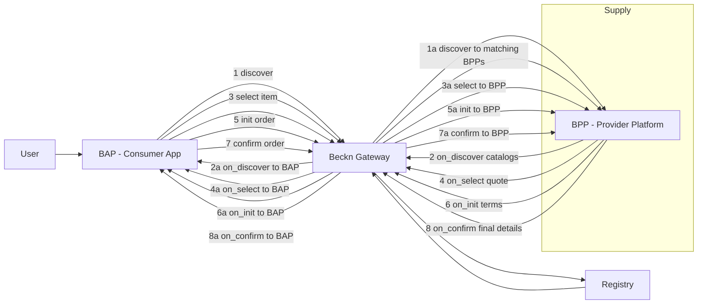

# Beckn
Beckn 2.0

Berikut penjelasan teknis tentang bagaimana Beckn 2.0 bekerja, dari sisi arsitektur, aktor, pesan, API, dan alur transaksi.

---

## 1. Inti cara kerja Beckn 2.0 (ringkas)

- Beckn adalah **protokol terbuka untuk jaringan komersial terdesentralisasi**: mendefinisikan “bahasa” dan “koreografi” agar aplikasi pembeli (BAP) dan sistem penjual/layanan (BPP) bisa saling menemukan dan bertransaksi tanpa platform pusat.【turn4find1】【turn4find2】
- Beckn **2.0** adalah versi LTS yang:
  - Memakai **satu endpoint per aksi** (mis. `/discover`, `/select`, `/confirm`, dll.) bukan satu endpoint universal.【turn3fetch0】
  - Tetap **asynchronous by default**: request dikirim, lalu hasil bisnis dikembalikan lewat callback (mis. `discover → on_discover`, `confirm → on_confirm`).【turn3fetch0】
  - Memisahkan **transport schema stabil** (cara mengirim pesan) dari **payload domain** (detail produk/layanan) yang bisa berevolusi.【turn3fetch0】

---

## 2. Siapa saja di jaringan Beckn 2.0?

Dari sisi “transaction layer”, ada 4 entitas utama:【turn4find1】【turn4find2】【turn4find3】【turn5find0】

1. **BAP – Beckn Application Platform (sisi demand / pembeli)**
   - Aplikasi konsumen (app/web) yang menangkap intent user, mengubah ke skema Beckn, dan mengirim ke jaringan.
   - BAP adalah **initiator transaksi** dan bisa menggabungkan layanan dari banyak BPP/network berbeda menjadi satu pengalaman terintegrasi.【turn4find1】

2. **BPP – Beckn Provider Platform (sisi supply / penjual)**
   - Platform yang punya **katalog, inventori, dan logika fulfillment**.
   - Bisa satu merchant atau aggregator banyak merchant.
   - Bertugas memproses pesanan dan memenuhi (fulfill) transaksi.【turn4find2】

3. **BG – Beckn Gateway (infra routing)**
   - “Switch” di antara BAP dan BPP.
   - Tugas utama: **meneruskan request dari BAP ke BPP yang relevan** (berdasarkan context dan registry) dan memastikan semua BPP aktif dan terdaftar mendapat kesempatan yang sama untuk ditemukan.【turn4find3】

4. **Registry (Network Registry)**
   - “Phonebook” yang mencatat BAP, BPP, BG yang **sah dan patuh aturan jaringan**.
   - Memberi lapisan kepercayaan: hanya peserta terdaftar yang boleh ikut transaksi di jaringan tersebut.【turn5find0】

---

## 3. Arsitektur berlapis Beckn 2.0

Secara konsep, Beckn punya arsitektur berlapis mirip jaringan (networking):【turn1fetch2】

1. **Core Layer (fondasi)**
   - Skema & model data universal (item, catalog, fulfillment, billing, dll.).
   - Spesifikasi API (endpoints, actions).
   - Protokol transaksi (koreografi interaksi antar peserta).

2. **Domain Layer (ekstensi vertikal)**
   - Extensi khusus industri: mobility, retail, logistics, healthcare, dll.
   - Di sini didefinisikan tipe objek khusus (mis. rute, slot waktu, tipe kendaraan) yang tetap di atas core layer.

3. **Transaction Layer (aktor & alur)**
   - Tempat BAP, BPP, BG, dan Registry berinteraksi lewat API Beckn.【turn4find1】

4. **Security & Governance Layer**
   - Autentikasi & otorisasi peserta.
   - **Digital signature** di setiap request (header `Authorization` dan `Signature`).【turn3fetch0】
   - Aturan jaringan (policy), compliance, dan dispute resolution.

---

## 4. Struktur pesan Beckn 2.0

Pesan Beckn 2.0 berupa JSON dengan dua bagian utama: `context` dan `message`. Contoh sederhana (versi 1.x di artikel, tapi konsepnya sama di 2.0):【turn6fetch0】

```json
{
  "context": {
    "domain": "mobility",
    "action": "search",
    "version": "2.0.0",
    "transaction_id": "abc123",
    "bap_id": "my-mobility-app",
    "bpp_id": "some-taxi-provider",
    "city": "Jakarta",
    "country": "ID"
  },
  "message": {
    "intent": {
      "fulfillment": {
        "start": { "location": { "gps": "-6.2,106.8" } },
        "end":   { "location": { "gps": "-6.3,106.7" } }
      }
    }
  }
}
```

- **`context`**: metadata tentang pesan (domain, aksi, versi, id transaksi, siapa pengirim, ttl, dll.).
- **`message`**: payload bisnis (intent, item, catalog, billing, fulfillment, dll.).

Di Beckn 2.0, **endpoint yang dipakai harus cocok dengan `context.action`** dan skema yang sudah didefinisikan di `beckn.yaml`.【turn3fetch0】

---

## 5. API Beckn 2.0: “satu endpoint per aksi”

Beckn 2.0 mendefinisikan **endpoint per aksi** (bukan satu endpoint generic). Contoh kelompok endpoint utama:【turn3fetch0】

### Discovery

- `POST /discover` – BAP mengirim intent untuk menemukan layanan.
- `POST /on_discover` – BPP/BG mengirimkan hasil discovery (catalog, item) ke BAP.

### Contracting / Ordering

- `POST /select` – BAP memilih item/penawaran tertentu.
- `POST /on_select` – BPP mengirim detail terpilih (harga, fulfillment, dll.).
- `POST /init` – BAP memulai transaksi (membuat order draft).
- `POST /on_init` – BPP mengembalikan kondisi transaksi (terms, payment, dll.).
- `POST /confirm` – BAP mengkonfirmasi order.
- `POST /on_confirm` – BPP mengkonfirmasi dan mengembalikan detail final.

### Fulfillment

- `POST /status` – BAP mengecek status order.
- `POST /on_status` – BPP mengembalikan status terbaru.
- `POST /track` – BAP minta tracking.
- `POST /on_track` – BPP kirim info tracking.
- `POST /update` – BAP mengupdate order (mis. alamat, waktu).
- `POST /on_update` – BPP konfirmasi update.
- `POST /cancel` – BAP membatalkan order.
- `POST /on_cancel` – BPP mengkonfirmasi pembatalan.

### Post-Fulfillment

- `POST /rate` – BAP mengirim rating/feedback.
- `POST /on_rate` – BPP meng-ack rating.
- `POST /support` – BAP minta bantuan/support.
- `POST /on_support` – BPP/BG merespons support.

Semua request:
- Menggunakan **HTTP POST** dengan JSON body.
- Mengirim **Beckn HTTP Signatures** di header `Authorization`.
- Respon **`Ack`** hanya menandakan bahwa pesan diterima; hasil bisnis dikembalikan lewat callback (mis. `on_confirm`).【turn3fetch0】

---

## 6. Alur transaksi sederhana di Beckn 2.0

Diagram ini menggambarkan alur discovery → select → init → confirm untuk satu BAP dan satu BPP (dengan BG/Registry sebagai infrastruktur).



Secara teknis:

1. **Discovery**
   - BAP kirim `POST /discover` dengan intent user (mis. lokasi jemput-antar).
   - BG melihat registry dan meneruskan ke BPP yang domain/konteksnya cocok.
   - BPP membalas dengan `on_discover` berisi katalog item/layanan yang relevan.

2. **Contracting**
   - BAP kirim `select` untuk item yang dipilih user.
   - BPP membalas `on_select` dengan harga, estimasi, dan syarat.
   - BAP kirim `init` untuk memulai order.
   - BPP membalas `on_init` dengan detail transaksi (payment terms, dll.).

3. **Confirmation**
   - BAP kirim `confirm` sebagai komitmen final.
   - BPP membalas `on_confirm` dengan detail final order (ID, status awal, dll.).

4. **Fulfillment & Post-fulfillment**
   - BAP bisa kirim `status`, `track`, `update`, `cancel`.
   - BPP membalas dengan `on_status`, `on_track`, `on_update`, `on_cancel`.
   - Setelah selesai, BAP bisa kirim `rate` dan BPP membalas `on_rate`.

---

## 7. Perbedaan teknis utama Beckn 2.0 vs versi sebelumnya

Beberapa poin penting yang membedakan 2.0:【turn3fetch0】

1. **Satu endpoint per aksi**
   - Di versi sebelumnya, ada kecenderungan menggunakan sedikit endpoint (mis. `/search` universal).
   - Di 2.0, setiap aksi punya path-nya sendiri (`/discover`, `/select`, `/confirm`, dll.).
   - Konsekuensinya:
     - Routing dan logging lebih jelas.
     - Validasi per aksi bisa lebih ketat.
     - Dokumentasi dan tooling lebih mudah.

2. **Transport schema yang stabil, payload domain yang fleksibel**
   - `beckn.yaml` mendefinisikan **transport contract**: cara mengirim pesan, callback, ack, signature, dll.
   - Detail domain (mis. struktur khusus retail vs mobility) bisa didefinisikan sebagai ekstensi di atas layer ini tanpa mengubah protokol inti.

3. **Callback asynchronous yang eksplisit**
   - Setiap aksi utama punya pasangan callback-nya:
     - `discover` → `on_discover`
     - `select` → `on_select`
     - `init` → `on_init`
     - `confirm` → `on_confirm`
     - dan seterusnya.【turn3fetch0】
   - Ini memudahkan implementasi sistem yang non-blocking dan event-driven.

4. **Keamanan dan signing yang lebih terstandar**
   - Semua request membawa **Beckn HTTP Signatures** di header `Authorization`.
   - Respon `Ack` ditandatangani dan header `Signature` bisa diverifikasi oleh pemanggil.【turn3fetch0】

---

## 8. Implikasi praktis untuk implementasi

Kalau Anda ingin membangun di atas jaringan Beckn 2.0 (misalnya ION):

1. **Sebagai BAP (aplikasi konsumen)**
   - Implementasikan client yang:
     - Membangun pesan Beckn (context + message) sesuai skema.
     - Mengirim ke BG atau langsung ke BPP (tergantung topologi jaringan).
     - Menyediakan endpoint callback untuk menerima `on_*` dari BPP/BG.
   - Mengelola state transaksi (transaction_id, status, dll.).

2. **Sebagai BPP (platform penjual/merchant)**
   - Menyediakan:
     - Endpoint `/discover`, `/select`, `/init`, `/confirm`, dll.
     - Catalog, pricing, fulfillment logic.
     - Signature verification untuk memastikan request sah.
   - Mengirim callback `on_*` ke BAP (via BG atau langsung).

3. **Infrastruktur jaringan (BG/Registry)**
   - Menjalankan **gateway** yang:
     - Melakukan routing berdasarkan context.
     - Menghubungi registry untuk mengetahui BPP yang valid.
   - Menjalankan **registry** yang:
     - Mendaftarkan dan memverifikasi BAP, BPP, BG.
     - Menyimpan public key dan metadata untuk autentikasi.

---

Kalau Anda ingin, langkah berikutnya bisa berupa: contoh konkret payload `discover` → `on_discover` untuk domain retail atau mobility, atau bagaimana cara mendaftarkan BAP/BPP baru di sebuah jaringan Beckn 2.0 (misalnya di ION).
