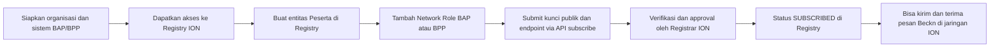

Secara teknis di Beckn 2.0, “mendaftarkan BAP/BPP” berarti:  
(1) mendaftar sebagai organisasi peserta, lalu  
(2) mendaftarkan satu atau lebih *network role* (BAP, BPP, atau BG) di Registry, lengkap dengan kunci publik dan endpoint, sehingga statusnya menjadi **SUBSCRIBED** dan boleh melakukan transaksi.【turn3fetch0】【turn16fetch0】

Di ION, ini dibungkus dengan alur bisnis: formulir online, KYC, dan perjanjian partisipasi, tapi secara teknis ujung‑ujungnya tetap sama: entitas Anda harus masuk ke Registry ION sebagai subscriber (BAP/BPP).【turn11fetch0】【turn12click0】

---

## 1. Gambaran alur besar



---

## 2. Konsep dasar: Registry, Registrar, Registrant, Subscriber

Dalam spesifikasi Beckn, istilah pentingnya adalah:【turn3fetch0】【turn7fetch0】

- **Registry (Network Registry)**  
  Komponen yang menyimpan daftar peserta sah di jaringan, termasuk:
  - identitas (subscriber_id),
  - peran (BAP/BPP/BG),
  - domain (retail, mobility, dst),
  - wilayah operasi,
  - kunci publik,
  - endpoint URL.

- **Registrar / Registration Platform**  
  Entitas terpercaya yang mengelola Registry. Di ION, ini adalah ION sendiri (dalam governance tertentu).

- **Registrant**  
  Organisasi yang mengajukan pendaftaran (misalnya PT X sebagai calon BAP atau BPP).

- **Subscriber**  
  Setelah disetujui, Registrant menjadi *Subscriber*:  
  - punya record di Registry dengan status **SUBSCRIBED**,  
  - boleh mengirim/menerima pesan Beckn di jaringan.【turn3fetch0】

Di lapis teknis, proses intinya adalah:

1. Registrant mengirim **credentials** ke Registrar (data legal, KYC, dsb).  
2. Jika lolos, Registrar membuat entri di Registry dengan status awal.  
3. Melalui serangkaian pertukaran kriptografis (challenge–response dengan kunci publik/privat), status diubah menjadi **SUBSCRIBED**.【turn3fetch0】【turn16fetch0】

---

## 3. Alur teknis mendaftarkan BAP/BPP di Beckn 2.0 (umum)

### 3.1. Siapkan sistem BAP/BPP Anda

Minimal:

1. **Implementasi BAP/BPP server**
   - Harus punya endpoint Beckn 2.0: `/search`, `/on_search`, `/select`, `/on_select`, `/init`, `/confirm`, dll, sesuai domain (retail, mobility, dll).  
   - Bisa:
     - bangun sendiri mengikuti spec Beckn 2.0, atau  
     - pakai adaptor seperti **Beckn‑ONIX** (middlewire yang sudah menangani protokol, signing, dsb).【turn0search6】【turn16fetch0】

2. **Generate pasangan kunci (signing & encryption)**
   - Signing key pair: untuk menandatangani setiap pesan Beckn.
   - Encryption key pair: untuk enkripsi payload (jika diperlakukan).  
   - Kunci **privat** tidak boleh keluar dari server Anda; kunci **publik** akan didaftarkan ke Registry.【turn3fetch0】【turn4search2】

3. **Siapkan URL publik**
   - `subscriber_url`: base URL BAP/BPP Anda, misalnya:
     - `https://bpp-ion-anda.com/beckn`  
   - Harus bisa diakses oleh Gateway dan BAP/BPP lain di jaringan ION.

### 3.2. Dapatkan akses ke Registry jaringan

Setiap jaringan Beckn punya Registry sendiri:

- Di Beckn global contohnya ada di `registry.becknprotocol.io`.  
- Di ION, ada Registry khusus ION dengan namespace `ion.id` (ini yang dipakai untuk *beckn_subscriber_reference* di issue yang Anda temukan sebelumnya).【turn0search5】【turn4search9】

Untuk bisa “mendaftar” Anda perlu:

- Akun di UI Registry (jika ada), atau
- Kredensial yang membolehkan Anda memanggil API `/subscribe` (biasanya diberikan setelah proses administratif dengan NFO/Network Facilitator Organization).【turn3fetch0】【turn16fetch0】

### 3.3. Buat entitas “Peserta” (Network Participant)

Di spesifikasi Registry, langkah ini disebut:

1. **Create Network Participant** – menambahkan entitas organisasi di Registry.【turn16fetch0】
   - Anda mengisi:
     - nama organisasi,
     - informasi legal,
     - mungkin NPWP/NIB untuk konteks Indonesia.
2. Untuk ION, langkah ini biasanya otomatis terjadi ketika Anda mengisi formulir “Join the Network” dan mereka menjalankan KYC.

### 3.4. Tambah Network Role: BAP atau BPP

Setelah entitas peserta ada, Anda menambah **Network Role**:【turn16fetch0】

- Pilih:
  - **BAP** jika Anda membangun aplikasi pembeli (buyer app), atau
  - **BPP** jika Anda menyediakan barang/jasa (seller platform).
- Isi:
  - **Network Domain**: misalnya `retail`, `mobility`, `logistics`, sesuai sektor yang Anda dukung di ION.【turn16fetch0】【turn11fetch0】
  - **Core Version**: versi Beckn spec (mis. 2.0.x).
  - **Operation Region**: wilayah operasi (bisa kosong jika global).

Untuk penggunaan Beckn‑ONIX, pembuatan Network Role dan Participant Key bisa otomatis dilakukan oleh script instalasi, jadi Anda tidak perlu mengisi manual lewat UI Registry.【turn16fetch0】

### 3.5. Daftarkan kunci publik via API `/subscribe`

Di level API, inti pendaftaran BAP/BPP adalah pemanggilan endpoint:

- `POST /subscribe` ke Registry.

Spesifikasi Beckn mencatat field yang dikirim:【turn3fetch0】

- `domain`
- `country`
- `city`
- `type` (BAP/BPP/BG)
- `subscriber_id`
- `subscriber_url`
- `signing_public_key`
- `encryption_public_key`

Contoh sederhana (pseudo-JSON):

```json
{
  "domain": "retail",
  "country": "IDN",
  "city": "std:021",
  "type": "BPP",
  "subscriber_id": "bpp-ion-anda",
  "subscriber_url": "https://bpp-ion-anda.com/beckn",
  "signing_public_key": "-----BEGIN PUBLIC KEY-----\n...\n-----END PUBLIC KEY-----",
  "encryption_public_key": "-----BEGIN PUBLIC KEY-----\n...\n-----END PUBLIC KEY-----"
}
```

Jika Anda pakai Beckn‑ONIX, script instalasi akan memanggil `/subscribe` secara otomatis dan mengirimkan kunci yang ada di `default.yml` container Protocol Server Anda.【turn4search4】【turn16fetch0】

### 3.6. Verifikasi dan status SUBSCRIBED

Setelah `/subscribe` berhasil:

1. Registry menyimpan record Anda.
2. Registry dan BAP/BPP Anda melakukan **pertukaran kriptografis** (challenge–response) untuk membuktikan bahwa Anda memang memegang kunci privat yang cocok dengan kunci publik yang terdaftar.  
3. Jika valid, status di Registry diubah menjadi **SUBSCRIBED**.【turn3fetch0】

Mulai dari titik itu:

- BAP/BPP Anda dianggap peserta sah.
- Bisa melakukan `search`, `on_search`, `confirm`, dll di jaringan ION.
- Setiap pesan yang Anda kirim harus ditandatangani dengan kunci privat; penerima akan memverifikasi tanda tangan dengan kunci publik yang diambil dari Registry.【turn4search2】【turn16fetch0】

---

## 4. Khusus ION: tampilan praktis di sisi pengguna

Dari sisi pengguna, ION memudahkan proses itu dengan UI:

1. **Masuk ke portal ION Central**
   - URL: `https://central.ion.id` (lanjutan dari tombol “Join the Network” di ion.id).【turn12click0】

2. **Pilih peran**
   Di halaman pertama, Anda memilih:
   - “Jual produk atau tawarkan jasa” → **arah ke BPP** (merchant/provider), atau  
   - “Bangun aplikasi untuk pelanggan menemukan dan membeli” → **arah ke BAP** (buyer app), atau  
   - “Saya melakukan keduanya”, atau  
   - “Bangun alat/layanan untuk peserta ION”, dll.【turn12click0】

   Ini menentukan bagaimana ION akan mengarahkan Anda ke alur BAP atau BPP.

3. **Isi data organisasi & sektor**
   - ION meminta:
     - detail bisnis,
     - sektor (Trade, Logistics, Mobility, Hospitality, Finance, Services),【turn11fetch0】
     - data yang relevan untuk KYC (terkait e‑KTP/NIB/QRIS, sesuai kebijakan ION).

4. **KYC & Network Participation Agreement**
   - ION melakukan verifikasi terhadap registri nasional dan Anda menandatangani perjanjian partisipasi jaringan.  
   - Di dokumentasi ion.id, langkah ini terjadi di background setelah Anda submit.【turn11fetch0】

5. **Pembuatan record di Registry ION**
   - Di belakang layar, ION:
     - membuat entitas Network Participant,
     - menambah Network Role (BAP/BPP),
     - memasukkan kunci publik dan endpoint Anda ke Registry ION (namespace `ion.id`),  
   sehingga status Anda menjadi SUBSCRIBED.

6. **Integrasi teknis**
   - Jika Anda:
     - memakai adaptor resmi ION/Beckn‑ONIX, konfigurasi endpoint dan signing key biasanya sudah otomatis.
     - bangun sendiri, Anda akan diberi:
       - `subscriber_id`,
       - URL Registry ION,
       - petunjuk cara memanggil `/subscribe` atau cara upload kunci publik.

---

## 5. Checklist praktis kalau Anda ingin daftar sebagai BAP/BPP di ION

Ringkasnya, langkah praktis:

1. **Tentukan peran**
   - BAP (aplikasi pembeli) atau BPP (platform penjual/provider).

2. **Bangun atau siapkan sistem BAP/BPP**
   - Implementasi endpoint Beckn 2.0 sesuai domain (retail/mobility/dll).  
   - Generate signing & encryption key pair.

3. **Daftar lewat ION Central**
   - Pilih opsi yang sesuai (jual produk / bangun aplikasi).  
   - Lengkapi data bisnis dan sektor.  
   - Selesaikan KYC dan perjanjian partisipasi.【turn11fetch0】【turn12click0】

4. **Ikuti petunjuk teknis dari tim ION**
   - Mereka akan:
     - memberikan detail Registry ION (URL, namespace `ion.id`),
     - mungkin meminta Anda mengirim kunci publik atau memanggil `/subscribe` dengan parameter yang sudah ditentukan.

5. **Tunggu hingga status SUBSCRIBED**
   - Setelah itu, Anda bisa:
     - mulai menerima `search` dari BAP (untuk BPP), atau
     - mulai mengirim `search` ke jaringan ION (untuk BAP).

---

Kalau Anda mau, saya bisa bantu buatkan contoh konkrit:

- payload lengkap `/subscribe` untuk BPP di domain retail di ION (misalnya dengan domain `nic2004:52110`), atau  
- contoh konfigurasi Beckn‑ONIX untuk BAP/BPP yang ingin terhubung ke ION.
